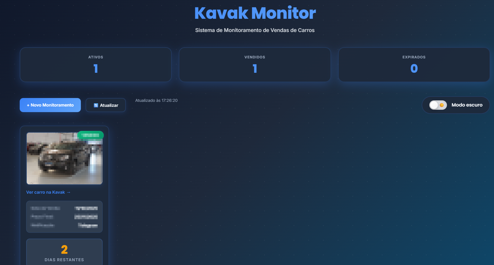
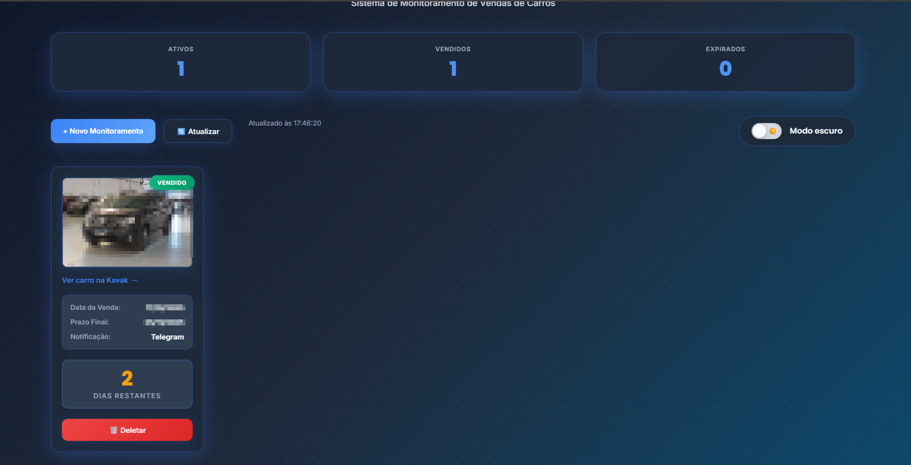

# Kavak Monitor

Sistema completo de monitoramento de vendas de carros na plataforma Kavak (kavak.com/br).

> 📚 **Documentação organizada em múltiplos arquivos?** Veja o **[Guia de Documentação](DOCUMENTACAO.md)** para navegar facilmente.

## 💡 Origem do Projeto

Este projeto nasceu de uma **necessidade pessoal real**. Ao vender um carro consignado para a Kavak, descobri que:

- A Kavak tem **até 45 dias corridos** para realizar o pagamento após a venda
- Se o carro for vendido antes desse prazo, o pagamento é antecipado
- Não existe notificação automática quando o carro é vendido
- A única forma de saber é verificando manualmente se o link ainda está no ar

Cansado de verificar o link várias vezes ao dia, criei este sistema para automatizar o monitoramento e me avisar imediatamente quando o carro fosse vendido.

## 📊 Visão Geral

Quando você vende um carro consignado para a Kavak, eles têm **45 dias corridos** para fazer o pagamento. Porém, se o carro for vendido antes, o pagamento é realizado antecipadamente. Este sistema monitora automaticamente quando o carro é vendido (link sai do ar) e acompanha o prazo de pagamento, enviando notificações via Telegram ou WhatsApp.

### Funcionalidades

- **Monitoramento Automático**: Verifica links da Kavak a cada 10 minutos
- **Detecção de Venda**: Identifica quando o link sai do ar (carro vendido)
- **Notificações Inteligentes**:
  - Quando o carro é vendido
  - Quando faltam 5 dias para o prazo de 45 dias
  - Notificações semanais toda sexta-feira às 10h
- **Interface Web**: Dashboard visual e responsivo
- **Proteção Anti-Spam**: reCAPTCHA v3 + rate limiting
- **Suporte para 500+ monitoramentos** simultâneos
- **Otimizado para Raspberry Pi 3**

## Início Rápido

### Pré-requisitos

- Docker e Docker Compose instalados
- Telegram Bot Token (tutorial incluído)

### Instalação em 5 Minutos

```bash
# 1. Clone ou baixe o projeto
cd ~/kavak-monitor

# 2. Configure as variáveis de ambiente
cp .env.example .env
nano .env  # Preencha TELEGRAM_BOT_TOKEN

# 3. Inicie o sistema
docker-compose up -d

# 4. Acesse a interface
# Abra o navegador em: http://localhost (ou IP do servidor)
```

Pronto! O sistema está rodando.

---

## 📸 Screenshots

### Interface Principal
> **TODO**: Adicionar screenshot da tela inicial do dashboard



### Criação de Monitoramento
> **TODO**: Adicionar screenshot do formulário de criação


### Lista de Monitoramentos Ativos
> **TODO**: Adicionar screenshot da lista de monitoramentos



### Notificação no Telegram
> **TODO**: Adicionar screenshot da notificação recebida no Telegram


---

## Estrutura do Projeto

```
kavak-monitor/
├── docker-compose.yml          # Orquestração dos containers
├── Dockerfile                  # Build do container único
├── .env.example                # Exemplo de variáveis de ambiente
├── .gitignore                  # Arquivos ignorados pelo Git
├── backend/
│   ├── app.py                  # API Flask completa
│   └── requirements.txt        # Dependências Python
├── frontend/
│   ├── index.html              # Interface web
│   └── guia_telegram.html      # Tutorial Telegram
├── docs/
│   └── images/                 # Screenshots para documentação
├── DOCUMENTACAO.md             # Guia de navegação da documentação
├── README.md                   # Este arquivo - Visão geral
├── DOCKER_DEPLOY.md            # Guia completo de deploy
├── QUICKSTART_DOCKER.md        # Quick start de 5 minutos
└── otimizacao_raspberry_pi.md  # Otimização para RPi
```

## Tecnologias Utilizadas

### Backend
- **Python 3.9+** - Linguagem principal
- **Flask** - Framework web
- **SQLite** - Banco de dados
- **APScheduler** - Tarefas agendadas
- **Requests** - Requisições HTTP

### Frontend
- **HTML5 + CSS3** - Interface
- **JavaScript Vanilla** - Lógica do cliente

### Infraestrutura
- **Docker + Docker Compose** - Containerização
- **Flask** - Serve tanto API quanto arquivos estáticos

## Como Funciona

### 📸 Fluxo Visual do Sistema
> **Espaço para screenshot**: Diagrama ou imagem mostrando o fluxo completo do monitoramento


### Fluxo de Monitoramento

1. **Usuário cria um monitoramento**:
   - Informa o link do carro na Kavak
   - Define a data da venda
   - Escolhe o tipo de notificação (Telegram/WhatsApp)

2. **Sistema verifica a cada 10 minutos**:
   - Faz requisição HTTP no link
   - Detecta se está online ou offline

3. **Detecção de venda (2 falhas consecutivas)**:
   - Se o link falhar 2 vezes seguidas → carro vendido
   - Envia notificação: "Carro Vendido!"

4. **Alerta de prazo (5 dias restantes)**:
   - Calcula dias restantes até completar 45 dias
   - Quando faltar ≤5 dias → envia alerta

5. **Notificações semanais**:
   - Toda sexta-feira às 10h → envia atualização do status

6. **Expiração (45 dias completos)**:
   - Após 45 dias da venda → status muda para "expirado"

### Sistema de Falhas Consecutivas

Para evitar falsos positivos (ex: site da Kavak temporariamente fora do ar):

- **1ª falha**: Incrementa contador, não notifica
- **2ª falha**: Marca como vendido, envia notificação
- **Volta ao ar**: Reseta contador de falhas

### Otimização para Raspberry Pi 3

O sistema foi otimizado para rodar em hardware limitado:

- **Verificação em lotes**: 50 sites por ciclo
- **Processamento paralelo**: 5 threads simultâneas
- **Cache inteligente**: 5 minutos de cache para requests
- **Timeout agressivo**: 5 segundos por site
- **Limites de recursos**: CPU 0.8, RAM 256MB

Com 500 monitoramentos:
- 10 ciclos de 50 sites = ~100 minutos para rodada completa
- Uso de CPU: ~20%
- Uso de RAM: ~150MB
- Temperatura: < 65°C

## Variáveis de Ambiente

### Obrigatórias

```env
TELEGRAM_BOT_TOKEN=123456789:ABCdefGHI...
```

### Opcionais (com defaults)

```env
PORT=80                         # Porta HTTP
MAX_WORKERS=5                   # Threads paralelas
BATCH_SIZE=50                   # Sites por ciclo
REQUEST_TIMEOUT=5               # Timeout em segundos
CHECK_INTERVAL=10               # Minutos entre verificações
MAX_MONITORAMENTOS_POR_IP=10    # Limite por IP
```

## Comandos Docker

### Gerenciamento Básico

```bash
# Iniciar
docker-compose up -d

# Parar
docker-compose down

# Reiniciar
docker-compose restart

# Ver status
docker-compose ps

# Ver logs
docker-compose logs -f

# Ver logs de um serviço específico
docker-compose logs -f backend
docker-compose logs -f frontend
```

### Backup e Manutenção

```bash
# Backup do banco de dados
docker cp kavak-backend:/app/data/kavak_monitor.db ~/backup_$(date +%Y%m%d).db

# Restaurar backup
docker cp ~/backup.db kavak-backend:/app/data/kavak_monitor.db
docker-compose restart backend

# Ver estatísticas do banco
docker exec kavak-backend sqlite3 /app/data/kavak_monitor.db "SELECT COUNT(*) FROM monitoramentos;"

# Limpar containers e volumes (CUIDADO!)
docker-compose down -v  # Remove volumes (apaga dados!)
```

### Monitoramento

```bash
# Ver uso de recursos
docker stats kavak-backend kavak-frontend

# Health check manual
curl http://localhost/api/health

# Acessar shell do backend
docker exec -it kavak-backend /bin/bash

# Ver últimas 50 linhas do log
docker-compose logs --tail=50 backend
```

## Segurança

### Camadas de Proteção

1. **Validações**
   - Apenas links kavak.com
   - Limite de 10 monitoramentos por IP
   - Sanitização de inputs

2. **Docker**
   - Usuários não-root
   - Network isolada
   - Limites de recursos

## Tutoriais

### Como criar um Telegram Bot

Veja o tutorial visual completo em:
- **Web**: `http://seu-ip/guia_telegram.html`
- **Arquivo**: `frontend/guia_telegram.html`

### Deploy completo com Docker

Leia: `DOCKER_DEPLOY.md`

### Quick start de 5 minutos

Leia: `QUICKSTART_DOCKER.md`

### Otimização para Raspberry Pi

Leia: `otimizacao_raspberry_pi.md`

## Troubleshooting

### Containers não iniciam

```bash
# Verificar logs
docker-compose logs

# Verificar configuração
docker-compose config

# Rebuild completo
docker-compose down
docker-compose build --no-cache
docker-compose up -d
```

### Notificações não chegam

1. Verifique o token no `.env`
2. Confirme que enviou `/start` para o bot
3. Verifique o Chat ID
4. Veja os logs: `docker-compose logs backend | grep -i telegram`

### Performance ruim no Raspberry Pi

1. Reduza `MAX_WORKERS` para 3
2. Aumente `CHECK_INTERVAL` para 15
3. Consulte: `otimizacao_raspberry_pi.md`

### Banco de dados corrompido

```bash
# Backup atual
docker cp kavak-backend:/app/data/kavak_monitor.db ~/corrupted.db

# Reinicializar banco
docker exec kavak-backend rm /app/data/kavak_monitor.db
docker-compose restart backend
```

## Capacidade

O sistema suporta até **500 monitoramentos simultâneos** no Raspberry Pi 3:

| Monitoramentos | CPU  | RAM   | Tempo/Ciclo |
|----------------|------|-------|-------------|
| 100            | 10%  | 100MB | ~20min      |
| 250            | 15%  | 130MB | ~50min      |
| 500            | 20%  | 150MB | ~100min     |
| 1000           | 40%  | 200MB | ~200min     |

Para mais de 500 monitoramentos, recomenda-se servidor mais potente.

## 🤝 Contribuindo

Contribuições são bem-vindas! Especialmente:

### Screenshots
Se você já está usando o sistema, pode ajudar adicionando screenshots reais:

1. Tire prints do sistema rodando (remova dados pessoais)
2. Coloque as imagens em `docs/images/` seguindo os nomes sugeridos
3. Remova os comentários `TODO` do README.md
4. Abra um Pull Request

Veja instruções detalhadas em: `docs/images/README.md`

### Melhorias no Código
- Correções de bugs
- Novas funcionalidades
- Otimizações de performance
- Melhorias na documentação

## 📄 Licença

Este projeto é fornecido "como está", sem garantias de qualquer tipo.

## Suporte

Para problemas, abra uma issue no repositório ou consulte a documentação:

- **`DOCUMENTACAO.md`** - 📚 **Guia completo de toda documentação disponível**
- `DOCKER_DEPLOY.md` - Deploy completo
- `QUICKSTART_DOCKER.md` - Início rápido
- `guia_telegram.html` - Configurar Telegram
- `otimizacao_raspberry_pi.md` - Otimizar performance

---

**Desenvolvido com Flask + Docker para monitoramento eficiente 24/7**
